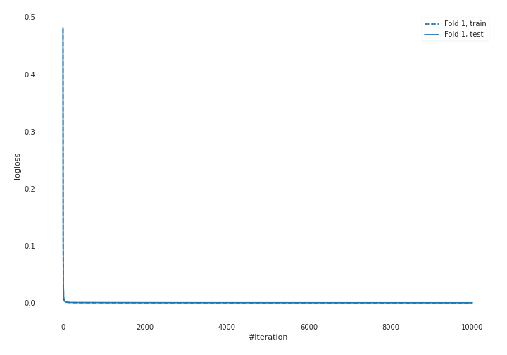

# Summary of 1_Default_CatBoost

## CatBoost
- **learning_rate**: 0.1
- **depth**: 6
- **rsm**: 0.9
- **subsample**: 1.0
- **min_data_in_leaf**: 15
- **explain_level**: 2

## Validation
 - **validation_type**: split
 - **train_ratio**: 0.75
 - **shuffle**: True
 - **stratify**: True

## Optimized metric
logloss

## Training time

11.2 seconds

## Metric details
|           |       score |     threshold |
|:----------|------------:|--------------:|
| logloss   | 0.000777144 | nan           |
| auc       | 1           | nan           |
| f1        | 1           |   0.499985    |
| accuracy  | 1           |   0.499985    |
| precision | 1           |   0.499985    |
| recall    | 1           |   2.12754e-05 |
| mcc       | 1           |   0.499985    |

## Confusion matrix (at threshold=0.499985)
|                     |   Predicted as negative |   Predicted as positive |
|:--------------------|------------------------:|------------------------:|
| Labeled as negative |                      73 |                       0 |
| Labeled as positive |                       0 |                      45 |

## Learning curves

## Permutation-based Importance
