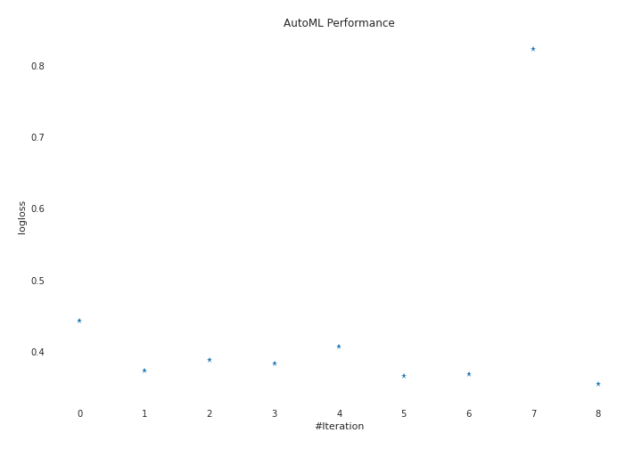
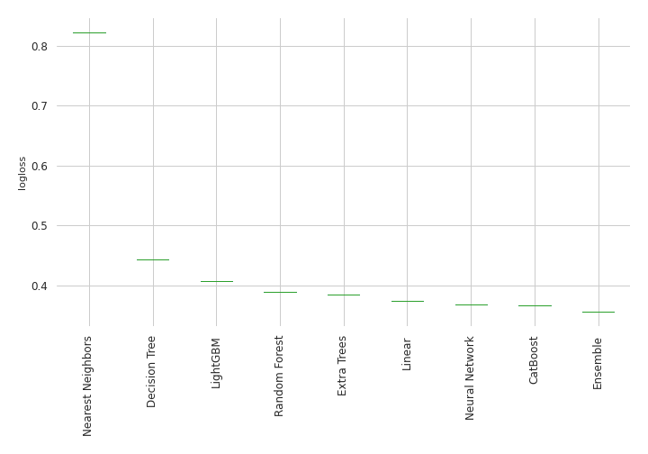

# AutoML Leaderboard

| Best model   | name                       | model_type        | metric_type   |   metric_value |   train_time | Link                                                 |
|:-------------|:---------------------------|:------------------|:--------------|---------------:|-------------:|:-----------------------------------------------------|
|              | 1_DecisionTree             | Decision Tree     | logloss       |       0.443461 |         5.25 | [Results link](1_DecisionTree/README.md)             |
|              | 2_Linear                   | Linear            | logloss       |       0.373872 |         2.64 | [Results link](2_Linear/README.md)                   |
|              | 3_Default_RandomForest     | Random Forest     | logloss       |       0.388762 |         3.58 | [Results link](3_Default_RandomForest/README.md)     |
|              | 4_Default_ExtraTrees       | Extra Trees       | logloss       |       0.383498 |         4.42 | [Results link](4_Default_ExtraTrees/README.md)       |
|              | 5_Default_LightGBM         | LightGBM          | logloss       |       0.406986 |         3.44 | [Results link](5_Default_LightGBM/README.md)         |
|              | 6_Default_CatBoost         | CatBoost          | logloss       |       0.366749 |         0.44 | [Results link](6_Default_CatBoost/README.md)         |
|              | 7_Default_NeuralNetwork    | Neural Network    | logloss       |       0.368384 |         2.55 | [Results link](7_Default_NeuralNetwork/README.md)    |
|              | 8_Default_NearestNeighbors | Nearest Neighbors | logloss       |       0.823311 |         0.58 | [Results link](8_Default_NearestNeighbors/README.md) |
| **the best** | Ensemble                   | Ensemble          | logloss       |       0.355632 |         0.59 | [Results link](Ensemble/README.md)                   |

### AutoML Performance

### AutoML Performance Boxplot
